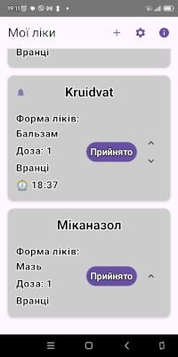
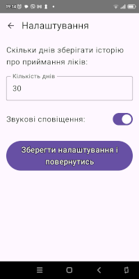
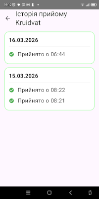
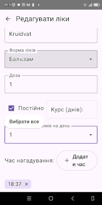

🇺🇦 MyMeds — Medication Tracker
MyMeds — це інтуїтивно зрозумілий Android-додаток, створений для допомоги користувачам у керуванні графіком прийому ліків. Додаток дозволяє додавати ліки, налаштовувати дозування, час прийому та відстежувати історію, щоб ніколи не пропускати важливі ліки.

🌟 Основні можливості:
Керування ліками: Додавання, редагування та видалення записів про ліки.

Розумні сповіщення: Нагадування про прийом із можливістю ввімкнення/вимкнення звуку.

Історія прийому: Зберігання даних про прийоми за певний період (налаштовується користувачем).

Гнучкі налаштування: Вибір тривалості зберігання історії та керування звуковими ефектами.

Сучасний UI: Побудований повністю на Jetpack Compose з використанням Material 3.

🛠 Технологічний стек:
Мова: Kotlin

UI: Jetpack Compose (Material 3)

База даних: Room (SQLite)

Архітектура: MVVM (Model-View-ViewModel)

Навігація: Compose Navigation

Збереження даних: SharedPreferences (через SettingsManager)

Ви можете завантажити останню версію додатка тут:
[Завантажити MyMeds.apk](https://github.com/needtools/MyMeds/releases/latest)

  &nbsp;
  &nbsp;
  &nbsp;
  

🇬🇧 MyMeds — Medication Tracker
MyMeds is an intuitive Android application designed to help users manage their medication schedules effectively. The app allows users to add medications, set dosages, specify intake times, and track history to ensure they never miss an important dose.

🌟 Key Features:
Medication Management: Add, edit, and delete medication records.

Smart Notifications: Reminders for intake with toggleable sound alerts.

Intake History: Keeps track of medication history for a user-defined period.

Flexible Settings: Customizable history retention duration and sound settings.

Modern UI: Built entirely with Jetpack Compose following Material 3 guidelines.

🛠 Tech Stack:
Language: Kotlin

UI Framework: Jetpack Compose (Material 3)

Database: Room (SQLite)

Architecture: MVVM (Model-View-ViewModel)

Navigation: Compose Navigation

Persistence: SharedPreferences (via SettingsManager)

You can download the latest version of the app here:
[Download MyMeds.apk](https://github.com/needtools/MyMeds/releases/latest)

